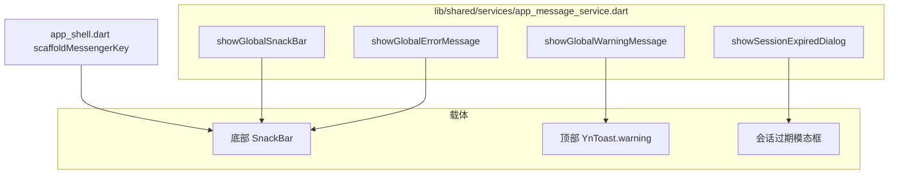

# 用户提示使用清单（SnackBar / YnToast）

> 最后复核：`lib/` 全目录关键词检索  
> `SnackBar`、`showSnackBar(`、`ScaffoldMessenger`、`showGlobalErrorMessage`、`showGlobalSnackBar`、`showGlobalWarningMessage`、`hideCurrentSnackBar`  
>  
> **迁移状态**：`lib/features/` 下已无 `ScaffoldMessenger.of(...).showSnackBar` 直调；  
> 底部 SnackBar 仅由 `app_message_service.dart` 统一发出。

---

## 1. 架构概览

| API | 载体 | 典型语义 | 会先 hide 当前 SnackBar |
|-----|------|----------|-------------------------|
| `showGlobalErrorMessage` | 底部 SnackBar | 错误、失败、异常 | 是 |
| `showGlobalSnackBar` | 底部 SnackBar | 成功、中性完成 | 是 |
| `showGlobalWarningMessage` | 顶部 `YnToast.warning` | 校验、约束、需登录 | 是（再出 Toast） |
| `showSessionExpiredDialog` | 模态对话框 | 会话过期 | 是（再弹窗） |

### 1.1 全局 Key 与挂载

| 符号 | 文件 | 说明 |
|------|------|------|
| `appScaffoldMessengerKey` | `app_message_service.dart` | SnackBar 挂载 |
| `appNavigatorKey` | `app_message_service.dart` | 对话框 / 无 context 时 Toast |
| `scaffoldMessengerKey: appScaffoldMessengerKey` | `app/bootstrap/app_shell.dart` | 根 `MaterialApp.router` |

### 1.2 约束提示实现

- `showGlobalWarningMessage` 封装 `lib/shared/base_widget/toast/yn_toast_widget.dart` → `YnToast.warning`
- 组件实现文件：`lib/examples/widget/yn_toast_widget.dart`（shared 路径为 re-export）

---

## 2. 基础设施层

### 2.1 网络拦截器

**文件**：`lib/core/network/interceptors/response_data_mode_interceptor.dart`

| 场景 | API | 条件 |
|------|-----|------|
| `simple` 模式业务 `code` 失败 | `showGlobalErrorMessage` | 未设置 `suppressGlobalErrorMessageExtraKey` |
| `DioException` / 传输错误 | `showGlobalErrorMessage` | 同上 |
| 会话过期码 | `showSessionExpiredDialog` | 不受 suppress 影响 |

**说明**：`publicDioClient` / `protectedDioClient` 默认 `ResponseDataMode.origin`，  
HTTP 200 且 `code != 0` 时**不会**在拦截器弹 SnackBar，由业务层自行处理。

### 2.2 认证请求抑制配置

**文件**：`lib/features/auth/api/auth_requests.dart`

| 请求 | `suppressGlobalErrorMessageExtraKey` | 失败提示由谁负责 |
|------|--------------------------------------|------------------|
| `requestAuthRegister` | **true** | `login_page` → `showGlobalErrorMessage` / `showGlobalWarningMessage` |
| `requestAuthLogin` | 无（不抑制） | 见 § 3.1 登录链路说明 |

---

## 3. 业务调用（按模块）

### 3.1 认证 `auth`

**`login_page.dart`**

| 触发 | API |
|------|-----|
| 注册：用户名为空 / 密码长度 / 确认密码 / 不一致 | `showGlobalWarningMessage` ×4 |
| 注册失败 | `showGlobalErrorMessage`（可读 `AppException.message`） |
| 登录失败 | `showGlobalErrorMessage(l10n.loginFailed)` 固定文案 |

**登录错误链路说明**：

1. `requestAuthLogin` 未抑制拦截器；`origin` 模式下业务 `code` 失败一般不经过拦截器 SnackBar。
2. `authLoginService` → `signIn` 返回 `false` 后，页面统一 `showGlobalErrorMessage(loginFailed)`，**未**展示服务端 `message`。
3. 纯网络层 `onError` 时，拦截器可能先弹一次 `showGlobalErrorMessage`，页面再弹 `loginFailed`（存在重复可能）。

---

### 3.2 首页 `home`

**`home_page.dart`**

| 触发 | API |
|------|-----|
| 远端登出失败 | `showGlobalErrorMessage(exception.message)` |

---

### 3.3 购物车 `cart`

**`cart_providers.dart`（间接 / Provider）**

| 触发 | API |
|------|-----|
| 未登录加购 | `showGlobalErrorMessage('Please sign in first.')` |
| 数量非法 | `showGlobalErrorMessage('Invalid product quantity.')` |
| 加购接口失败 | `showGlobalErrorMessage(exception.message)` |

**`cart_page.dart`**

| 触发 | API |
|------|-----|
| 预提交校验失败 | `showGlobalErrorMessage(message)` |
| 预提交请求失败 | `showGlobalErrorMessage(e.message)` |
| 改规格详情加载失败 | `showGlobalErrorMessage(productDetailLoadFailed)` |

**`pre_order_page.dart`**

| 触发 | API |
|------|-----|
| 保存 SM 失败 | `showGlobalErrorMessage(e.message)` |
| 改规格详情加载失败 | `showGlobalErrorMessage(productDetailLoadFailed)` |
| Checkout 失败 | `showGlobalErrorMessage('Checkout failed')` |
| Checkout 成功 | `showGlobalSnackBar('Order created successfully')` |

**`cart_clear_all_confirm_flow.dart`**

| 触发 | API |
|------|-----|
| 清空 / 删除选中成功 | `showGlobalSnackBar` |
| 清空 / 删除选中失败 | `showGlobalErrorMessage` |

---

### 3.4 商品 `product`

**`product_detail_page.dart`**

| 触发 | API |
|------|-----|
| 销售价为 0 阻止加购 | `showGlobalErrorMessage` |
| 加购成功 | `showGlobalSnackBar` |

**`product_list_page.dart`**

| 触发 | API |
|------|-----|
| 未登录加购（后跳登录） | `showGlobalWarningMessage` |
| 加购成功 | `showGlobalSnackBar` |
| 详情加载失败 | `showGlobalErrorMessage` |

**`product_scan_fab_flow.dart`**

| 触发 | API |
|------|-----|
| 未登录扫码（后跳登录） | `showGlobalWarningMessage` |
| 扫码详情加载失败 | `showGlobalErrorMessage` |
| 无匹配 SKU | `showGlobalWarningMessage` |
| 扫码加购成功 | `showGlobalSnackBar` |

---

### 3.5 个人中心 `profile`

**`profile_page.dart`**

| 触发 | API |
|------|-----|
| 资料更新成功 | `showGlobalSnackBar` |
| 切回主账号成功 | `showGlobalSnackBar`（后 `go` 首页） |
| 切回主账号失败 | `showGlobalErrorMessage` |

**`profile_favorites_section_widget.dart`**

| 触发 | API |
|------|-----|
| 未登录加购 | `showGlobalWarningMessage` |
| 加购成功 | `showGlobalSnackBar` |
| 详情加载失败 | `showGlobalErrorMessage` |

**`profile_my_customers_section_widget.dart`**

| 触发 | API |
|------|-----|
| 代客登录成功（`postFrame` 后） | `showGlobalSnackBar` |
| 代客登录失败 | `showGlobalErrorMessage` |
| 删除客户成功 | `showGlobalSnackBar` |
| 客户订单加载失败 | `showGlobalErrorMessage` |
| 删除客户失败（对话框内） | `showGlobalErrorMessage` |

**`store_customer_form_bottom_sheet.dart`**

| 触发 | API |
|------|-----|
| 新增/编辑成功 | `showGlobalSnackBar('Success')` |
| 失败 | **页面内** `_errorMessage` + `SelectableText.rich`（非 SnackBar） |

**`store_customer_common_password_bottom_sheet.dart`**

| 触发 | API |
|------|-----|
| 重置通用密码成功 | `showGlobalSnackBar` |
| 失败 | 页面内 `_errorMessage`（非 SnackBar） |

**`switch_site_bottom_sheet.dart`**

| 触发 | API |
|------|-----|
| 切换站点失败 | `showGlobalErrorMessage` |

---

## 4. 行为特征与约定

1. **唯一 SnackBar 出口**：`app_message_service.dart` 内 `showSnackBar`；业务禁止直调 `ScaffoldMessenger`。
2. **错误 vs 约束**：失败走 `showGlobalErrorMessage`；表单校验、需登录、无 SKU 等走 `showGlobalWarningMessage`（顶部 Toast）。
3. **成功**：统一 `showGlobalSnackBar`；路由切换后仍需可见时同样适用（依赖全局 messenger key）。
4. **hide 策略**：三种全局 API 在展示前均会 `hideCurrentSnackBar()`（警告 additionally 出 YnToast）。
5. **未纳入本清单的 UI 错误**：部分表单/BottomSheet 仍用页内 `SelectableText.rich` 展示错误（见 § 3.5），与项目规则「视图中错误用 SelectableText」一致。

---

## 5. 涉及文件清单（去重 19 个）

| 分层 | 路径 |
|------|------|
| 应用壳 | `lib/app/bootstrap/app_shell.dart` |
| 全局入口 | `lib/shared/services/app_message_service.dart` |
| 网络 | `lib/core/network/interceptors/response_data_mode_interceptor.dart` |
| 认证 API | `lib/features/auth/api/auth_requests.dart` |
| 认证 UI | `lib/features/auth/presentation/pages/login_page.dart` |
| 首页 | `lib/features/home/presentation/pages/home_page.dart` |
| 购物车 | `lib/features/cart/controllers/cart_providers.dart` |
| 购物车 | `lib/features/cart/presentation/pages/cart_page.dart` |
| 购物车 | `lib/features/cart/presentation/pages/pre_order_page.dart` |
| 购物车 | `lib/features/cart/presentation/widgets/cart_clear_all_confirm_flow.dart` |
| 商品 | `lib/features/product/presentation/pages/product_detail_page.dart` |
| 商品 | `lib/features/product/presentation/pages/product_list_page.dart` |
| 商品 | `lib/features/product/presentation/widgets/product_scan_fab_flow.dart` |
| 个人中心 | `lib/features/profile/presentation/pages/profile_page.dart` |
| 个人中心 | `lib/features/profile/presentation/widgets/profile_favorites_section_widget.dart` |
| 个人中心 | `lib/features/profile/presentation/widgets/profile_my_customers_section_widget.dart` |
| 个人中心 | `lib/features/profile/presentation/widgets/store_customer_common_password_bottom_sheet.dart` |
| 个人中心 | `lib/features/profile/presentation/widgets/store_customer_form_bottom_sheet.dart` |
| 个人中心 | `lib/features/profile/presentation/widgets/switch_site_bottom_sheet.dart` |

**Toast 组件（非业务调用点）**

- `lib/shared/base_widget/toast/yn_toast_widget.dart`（export）
- `lib/examples/widget/yn_toast_widget.dart`（实现）
- `lib/examples/page/home.dart`（示例/demo）

---

## 6. 相关文档

| 文档 | 说明 |
|------|------|
| `docs/snackbar_migration_test_cases.md` | 迁移后手动测试用例 |
| `docs/DIO_OPTIONS.md` | Dio `extra` / 响应模式说明 |
| `.cursor/rules/flutter-rules.mdc` | 视图中错误优先 `SelectableText.rich` 等规范 |

---

## 7. 统计摘要

| 类型 | 调用方文件数（约） | 说明 |
|------|-------------------|------|
| `showGlobalErrorMessage` | 14+ | 含拦截器、cart provider |
| `showGlobalSnackBar` | 12+ | 成功/完成类 |
| `showGlobalWarningMessage` | 4 | login、商品列表、扫码、收藏 |
| `ScaffoldMessenger` 直调（`lib/features`） | **0** | 已收口 |
| 页内 `SelectableText` 错误 | 2 | 客户表单/通用密码 sheet |
